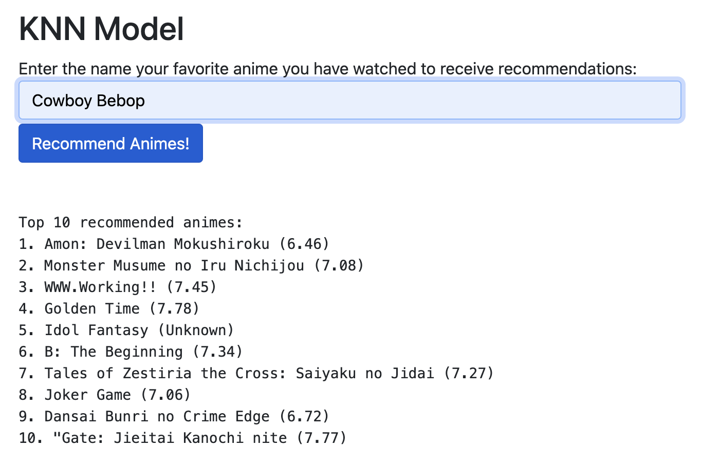
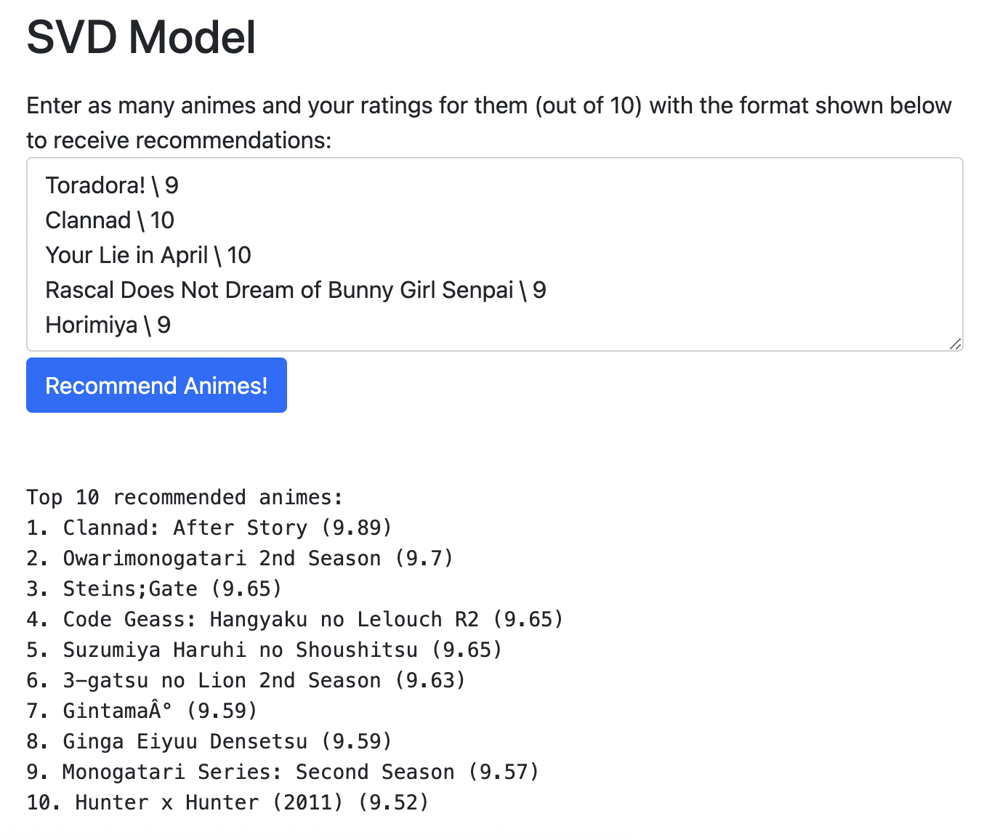

# Anime Recommender

A collaborative filtering recommender systems project to recommend animes to users. Test out the models here: [animerecom.com](animerecom.com)

## Table of Contents

1. [Introduction](#introduction)
2. [Usage](#usage)
3. [Installation](#installation)
4. [Contact](#contact)

## Introduction

In this machine learning project, there are 2 different collaborative filtering models that are trained to create recommendation systems for recommending animes to users similar to a streaming service.

## Usage

#### 1. The KNN (K-Nearest Neighbors) Model

Type in the name your favorite anime in the textbox. Make sure the name matches what is shown on myanimelist.com.

#### 2. The SVD (Singular Value Decomposition) Model

Type in an anime name followed by a score separated by a backslash as shown in the textbox. Each anime and its rating must be on its own line.

## Installation

Follow these steps to set up the project locally:

#### 1. Clone the repository

`git clone https://github.com/asshelke/anime-recommender.git`

#### 2. Install all necessary Python dependencies

`pip install -r requirements.txt`

#### 3. Start the Flask server

`python app.py`

#### 4. View the website locally

http://127.0.0.1:5000